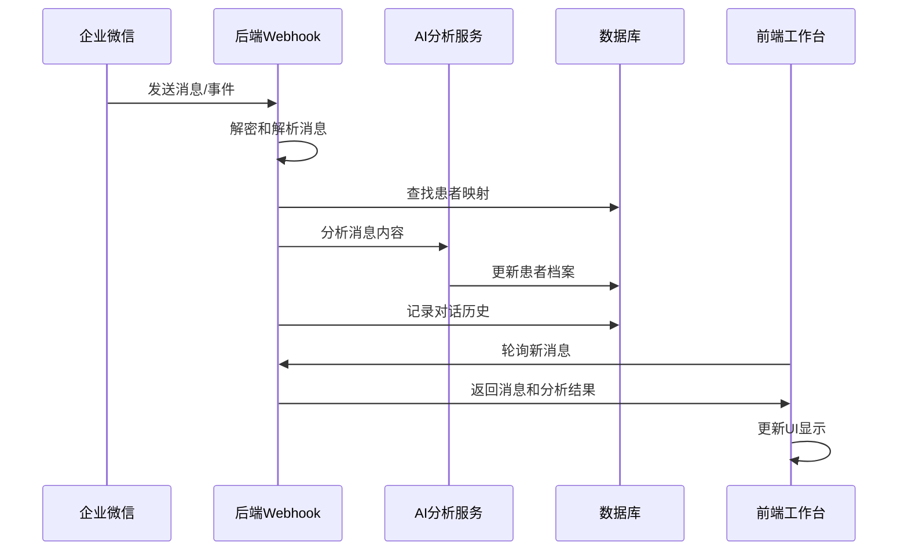

# 企业微信项目开发者文档

## 项目概述

企业微信慢性病管理项目，集成AI分析能力，围绕"群管理机器人/群客服"与"个人医生助手"两条核心业务主线，在持续互动中获取信息、完成分析总结，并沉淀完善成员/患者档案。

### 技术栈
- **后端**：Node.js + Express + TypeScript + PostgreSQL + Redis
- **前端**：React 18 + TypeScript + Vite + Tailwind CSS
- **测试**：Jest + React Testing Library + Playwright
- **部署**：Docker + Docker Compose + GitHub Actions
- **监控**：Sentry（可选）+ 内置健康检查

## 项目结构

### 后端结构
```
backend/src/
├── main.ts                    # 应用入口
├── routes.ts                  # 路由配置
├── infra/                     # 基础设施
│   ├── config/               # 环境配置
│   ├── db/                   # 数据库连接和迁移
│   ├── cache/                # Redis缓存
│   └── monitoring/           # 监控和健康检查
├── modules/                   # 业务模块
│   ├── patient/              # 患者管理
│   ├── health-record/        # 健康记录
│   ├── wecom-intelligence/   # 企业微信集成
│   ├── enrollment/           # 用户注册和绑定
│   └── dashboard/            # 仪表板
├── shared/                    # 共享代码
│   ├── middleware/           # Express中间件
│   ├── errors/               # 错误处理
│   ├── di/                   # 依赖注入容器
│   └── repositories/         # Repository模式基础类
└── __tests__/                # 测试文件
```

### 前端结构
```
frontend/src/
├── App.tsx                    # 主应用组件
├── main.tsx                   # 应用入口
├── components/                # 可复用组件
│   ├── Loading.tsx           # 加载组件
│   ├── ErrorDisplay.tsx      # 错误显示组件
│   ├── EmptyState.tsx        # 空状态组件
│   └── FeedbackWidget.tsx    # 用户反馈组件
├── pages/                     # 页面组件
│   ├── DoctorWorkbench.tsx   # 医生工作台
│   ├── ArchiveManagement.tsx # 档案管理
│   └── Dashboard.tsx         # 仪表板
├── api/                       # API客户端
├── hooks/                     # 自定义Hook
├── utils/                     # 工具函数
├── mocks/                     # 模拟数据
└── __tests__/                # 测试文件
```

## 核心业务流程

### 1. 企业微信集成流程


### 2. 患者绑定流程
```
1. 患者添加企业微信好友
   ↓
2. 系统接收 add_external_contact 事件
   ↓
3. 记录 externalUserId 和 welcomeCode
   ↓
4. 医生在后台手动关联患者档案
   ↓
5. 建立 patient_wecom_binding 记录
   ↓
6. 后续消息自动关联到正确患者
```

## 开发环境设置

### 1. 依赖安装
```bash
# 后端
cd backend
npm install

# 前端  
cd frontend
npm install
```

### 2. 数据库初始化
```bash
# 使用Docker启动PostgreSQL和Redis
cd /root/wecom-project/wecom-project
docker-compose up -d

# 等待数据库就绪后运行迁移
cd backend
npm run db:migrate  # 如果存在迁移脚本
```

### 3. 环境变量配置
复制示例环境文件并修改：
```bash
cp backend/.env.example backend/.env
cp frontend/.env.example frontend/.env
```

关键环境变量：
- `WECOM_CORP_ID`, `WECOM_SECRET`, `WECOM_TOKEN`, `WECOM_AES_KEY` - 企业微信配置
- `OPENAI_API_KEY` - AI服务密钥
- `SENTRY_DSN` - 错误监控（可选）

### 4. 启动服务
```bash
# 后端开发服务器
cd backend
npm run dev

# 前端开发服务器  
cd frontend
npm run dev
```

## API文档

### 认证
所有API请求（除了公共端点）需要在Header中包含Bearer Token：
```
Authorization: Bearer <jwt_token>
```

### 主要API端点

#### 患者管理
- `GET /api/v1/patients` - 获取患者列表
- `GET /api/v1/patients/:id` - 获取患者详情
- `POST /api/v1/patients/:id/wecom-binding` - 绑定患者到企业微信

#### 健康记录
- `POST /api/v1/health-records/glucose` - 添加血糖记录
- `POST /api/v1/health-records/blood-pressure` - 添加血压记录
- `GET /api/v1/patients/:id/health-records` - 获取患者健康记录

#### 企业微信集成
- `GET /api/v1/wecom/webhook` - 企业微信回调验证
- `POST /api/v1/wecom/webhook` - 接收企业微信消息
- `GET /api/v1/wecom/conversations` - 获取对话列表
- `POST /api/v1/business-routing/messages/process` - 处理业务路由

#### 健康检查
- `GET /health` - 完整健康检查
- `GET /health/liveness` - 存活检查（用于Kubernetes）
- `GET /health/readiness` - 就绪检查（用于负载均衡器）
- `GET /health/metrics` - 应用指标

## 测试指南

### 运行测试
```bash
# 后端测试
cd backend
npm test                    # 运行所有测试
npm run test:watch         # 监听模式
npm run test:coverage      # 生成覆盖率报告

# 前端单元测试
cd frontend
npm test
npm run test:coverage

# 端到端测试
cd frontend
npm run test:e2e           # 无头模式
npm run test:e2e:headed    # 有头模式
npm run test:e2e:ui        # Playwright UI
```

### 测试策略
1. **单元测试**：覆盖核心业务逻辑和服务
2. **组件测试**：验证React组件渲染和交互
3. **端到端测试**：验证完整业务流程
4. **集成测试**：验证模块间协作

### 测试覆盖率目标
- 后端单元测试：≥ 80%
- 前端组件测试：≥ 70%
- 关键业务流程E2E测试：100%覆盖

## 代码规范

### TypeScript
- 启用严格模式：`"strict": true`
- 使用接口定义类型，避免`any`
- 导出类型和接口，便于复用

### 命名约定
- 文件和目录：kebab-case（例如：`patient.service.ts`）
- 类和类型：PascalCase（例如：`PatientService`）
- 变量和函数：camelCase（例如：`getPatientById`）
- 常量：UPPER_SNAKE_CASE（例如：`MAX_RETRY_COUNT`）

### 提交规范
使用Conventional Commits：
- `feat:` 新功能
- `fix:` bug修复
- `docs:` 文档更新
- `test:` 测试相关
- `refactor:` 重构（不改变功能）
- `chore:` 构建过程或辅助工具变更

## 部署指南

### 开发环境
```bash
# 使用Docker Compose
docker-compose up -d

# 访问应用
前端：http://localhost:5173
后端API：http://localhost:3000
```

### 生产环境
1. **构建镜像**：
   ```bash
   docker build -f backend/Dockerfile -t wecom-backend:latest .
   docker build -f frontend/Dockerfile -t wecom-frontend:latest .
   ```

2. **使用生产配置**：
   ```bash
   docker-compose -f docker-compose.prod.yml up -d
   ```

3. **环境变量**：确保设置所有生产环境变量

### CI/CD流水线
GitHub Actions配置在 `.github/workflows/deploy.yml`，包含：
1. 代码检查和格式化
2. 单元测试和覆盖率检查
3. 端到端测试
4. 容器构建和推送
5. 部署到目标环境

## 监控和运维

### 健康检查端点
- `/health` - 完整健康状态
- `/health/liveness` - 存活检查
- `/health/readiness` - 就绪检查
- `/health/metrics` - 应用指标

### 错误监控
集成Sentry错误监控：
1. 设置 `SENTRY_DSN` 环境变量
2. 错误自动捕获和上报
3. 性能事务跟踪

### 日志
- 结构化日志输出
- 错误日志包含上下文信息
- 敏感信息自动脱敏

## 故障排除

### 常见问题

#### 1. 企业微信回调失败
- 检查 `WECOM_TOKEN` 和 `WECOM_AES_KEY` 配置
- 验证回调URL格式正确
- 查看Webhook服务日志

#### 2. 数据库连接失败
- 检查PostgreSQL服务状态
- 验证数据库连接字符串
- 检查网络连接和防火墙

#### 3. AI服务不可用
- 验证API密钥配置
- 检查网络连接
- 查看服务配额和限流

#### 4. 前端构建失败
- 检查Node.js版本兼容性
- 验证TypeScript配置
- 清理node_modules重装依赖

### 调试工具
```bash
# 后端调试
cd backend
npm run dev -- --inspect

# 数据库查询
docker-compose exec postgres psql -U postgres chronic_disease

# Redis监控
docker-compose exec redis redis-cli monitor
```

## 贡献指南

1. Fork项目仓库
2. 创建功能分支：`git checkout -b feat/your-feature`
3. 提交更改：`git commit -m 'feat: add your feature'`
4. 推送到分支：`git push origin feat/your-feature`
5. 创建Pull Request

### 开发流程
1. 从`main`分支创建新分支
2. 编写代码并添加测试
3. 运行所有测试确保通过
4. 更新相关文档
5. 创建PR并等待代码审查

## 相关资源

- [企业微信开发文档](https://developer.work.weixin.qq.com/document)
- [TypeScript文档](https://www.typescriptlang.org/docs)
- [React文档](https://react.dev)
- [Jest测试框架](https://jestjs.io)
- [Playwright E2E测试](https://playwright.dev)
- [Docker文档](https://docs.docker.com)

## 更新记录

### 2026-04-02
- 完成产品级开发基础设施
- 建立完整测试体系（单元测试+E2E测试）
- 集成性能监控和用户反馈
- 完善开发文档和部署指南

### 2026-03-XX
- 初始项目导入和基础架构搭建
- 企业微信集成和AI分析功能
- 患者管理和档案系统